# Financial Data Analysis & Business Analysis with SQL
Tools: <br>
👩🏻‍💻 Visual Studio Code <br>
👩🏻‍💻 SQLite <br>
🗂️ GitHub <br>
📊 SQLNotebook

## Dataset
this dataset from .....

## Cleaning & Reformat
1.  **Display Dataset Columns** : Use the following command to display all columns in the dataset

    ```sql
    PRAGMA table_info(financials);
    ```
    <p align="center">
      <kbd>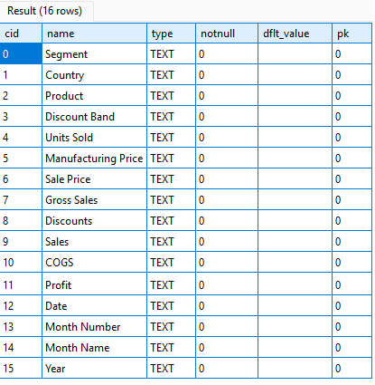 </kbd> <br>
      Fig.1. Table Info
    </p>
    
    The dataset contains the following columns:
    * segment, country, product, discount_band, unit_sold, manufacturing_price, sales_price, gross_sales, discount, sales, cogs, profit, date, month_number, month_name, year
2. **Display Sample Data in Columns**: Use the SELECT query to view a subset of the data in the dataset columns.
    ```sql
    SELECT * FROM Financials LIMIT 6;
    ```
    <p align="center">
      <kbd>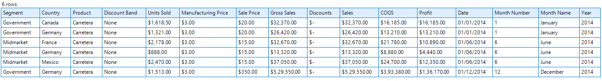 </kbd> <br>
      Fig.2. Preview Data
    </p>
    
    **Check Results**
    * several columns contain dollar signs, such as Unit Sold, Manufacturing Price, and Sale Price.
    * We need to remove the dollar signs from these columns. Additionally, we must convert these columns from text to float.

3. **Reformat Data** : Use the following SQL commands to update the necessary columns 
    ```sql
    UPDATE financials
    SET "Units Sold" = CAST(REPLACE(REPLACE(REPLACE("Units Sold", '$', ''), ' ', ''), ',', '') AS FLOAT),
        "Manufacturing Price" = CAST(REPLACE(REPLACE(REPLACE("Manufacturing Price", '$', ''), ' ', ''), ',', '') AS FLOAT),
        "Sale Price" = CAST(REPLACE(REPLACE(REPLACE("Sale Price", '$', ''), ' ', ''), ',', '') AS FLOAT),
        "Gross Sales" = CAST(REPLACE(REPLACE(REPLACE("Gross Sales", '$', ''), ' ', ''), ',', '') AS FLOAT),
        "Discounts" = CAST(REPLACE(REPLACE(REPLACE("Discounts", '$', ''), ' ', ''), ',', '') AS FLOAT),
        "Sales" = CAST(REPLACE(REPLACE(REPLACE("Sales", '$', ''), ' ', ''), ',', '') AS FLOAT),
        "COGS" = CAST(REPLACE(REPLACE(REPLACE("COGS", '$', ''), ' ', ''), ',', '') AS FLOAT),
        "Profit" = CAST(REPLACE(REPLACE(REPLACE("Profit", '$', ''), ' ', ''), ',', '') AS FLOAT);

    ```
    **The Results** (use query select)
    ```sql
    SELECT * FROM Financials LIMIT 6;
    ```
    <p align="center">
      <kbd>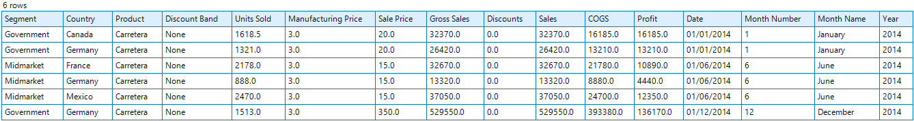 </kbd> <br>
      Fig.3. after reformat
    </p>

4. **Check Duplicates** : Use the following SQL commands to check duplicate data
    ```sql
        SELECT * 
        FROM Financials 
        GROUP BY 
            "Segment", 
            "Country", 
            "Product", 
            "Discount Band", 
            "Units Sold", 
            "Manufacturing Price",
            "Sale Price",
            "Gross Sales",
            "Discounts",
            "Sales",
            "COGS",
            "Profit",
            "Month Number", 
            "Month Name"
        HAVING COUNT(*) > 1;
    ```
    <p align="center">
    <kbd> </kbd> <br>
        Fig.4. Check Duplicate Data
    </p>
        
    **The Results**
    * There is no duplicate data
 


5. **Check Missing Values** : Use the following SQL commands to check Missing value
    ```sql
        SELECT
            SUM(CASE WHEN "Segment" IS NULL THEN 1 ELSE 0 END) AS Missing_Segment,
            SUM(CASE WHEN "Country" IS NULL THEN 1 ELSE 0 END) AS Missing_Country,
            SUM(CASE WHEN "Product" IS NULL THEN 1 ELSE 0 END) AS Missing_Product,
            SUM(CASE WHEN "Discount Band" IS NULL THEN 1 ELSE 0 END) AS Missing_Discount_Band,
            SUM(CASE WHEN "Units Sold" IS NULL THEN 1 ELSE 0 END) AS Missing_Units_Sold,
            SUM(CASE WHEN "Manufacturing Price" IS NULL THEN 1 ELSE 0 END) AS Missing_Manufacturing_Price,
            SUM(CASE WHEN "Sale Price" IS NULL THEN 1 ELSE 0 END) AS Missing_Sale_Price,
            SUM(CASE WHEN "Gross Sales" IS NULL THEN 1 ELSE 0 END) AS Missing_Gross_Sales,
            SUM(CASE WHEN "Discounts" IS NULL THEN 1 ELSE 0 END) AS Missing_Discounts,
            SUM(CASE WHEN "Sales" IS NULL THEN 1 ELSE 0 END) AS Missing_Sales,
            SUM(CASE WHEN "COGS" IS NULL THEN 1 ELSE 0 END) AS Missing_COGS,
            SUM(CASE WHEN "Profit" IS NULL THEN 1 ELSE 0 END) AS Missing_Profit,
            SUM(CASE WHEN "Date" IS NULL THEN 1 ELSE 0 END) AS Missing_Date,
            SUM(CASE WHEN "Month Number" IS NULL THEN 1 ELSE 0 END) AS Missing_Month_Number,
            SUM(CASE WHEN "Month Name" IS NULL THEN 1 ELSE 0 END) AS Missing_Month_Name,
            SUM(CASE WHEN "Year" IS NULL THEN 1 ELSE 0 END) AS Missing_Year
        FROM "Financials";

    ```
    <p align="center">
    <kbd> </kbd> <br>
        Fig.5. Check Missing Value
    </p>
        
    **the results**
    * There is no Missing Value   

## Bivariat
1. **Analyzing Total Sales Revenue perCountry** : Use the following SQL commands to check Missing value
    ```sql
        SELECT 
            Country,
            SUM(Sales) AS Total_Sales_Revenue
        FROM Financials
        GROUP BY Country
        ORDER BY Total_Sales_Revenue DESC
    ```
    <p align="center">
    <kbd>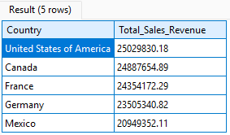 </kbd> <br>
        Fig.7. Check TotalSalesRevenueperCountry
    </p>
        
    **Output Overview**
    - the highest sales revenue is United States of America. The total sales revenue for United States is $25,029,830. 
    - The second highest is Canada. The total sales revenue for Canada is $24,887,654. 
    - The third highest is France. The total sales revenue for France is $24,354,172. 
    - The fourth highest is Germany. The total sales revenue for Germany is $23,505,340. 
    - And the fifth highest is Mexico. The total sales revenue for Mexico is 20,949,000 $354,352. 

2. **Analyzing Total Sales Revenue perProduct** : Use the following SQL commands to check Missing value
    ```sql
        SELECT 
            Product,
            SUM(Sales) AS Total_Sales_Revenue
        FROM Financials
        GROUP BY Product
        ORDER BY Total_Sales_Revenue DESC;
    ```
    <p align="center">
    <kbd>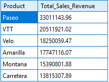 </kbd> <br>
        Fig.6. Check TotalSalesRevenueperProduct
    </p>
        
    **Output Overview**    
    1. **Top 5 Products by Profit Margin**:
    - **1. Amarilla**: 
        - **Profit Margin**: 16.5%
        - **Insight**: Highest profit margin among all products.
    - **2. CTT**: 
        - **Profit Margin**: 15%
        - **Insight**: Second highest profit margin.
    - **3. Paseo**: 
        - **Profit Margin**: 14%
        - **Insight**: Despite having the highest total sales revenue, Paseo ranks third in profit margin.
    - **4. Carrera**: 
        - **Profit Margin**: 14.9%
        - **Insight**: Strong performer in terms of profit margin.
    - **5. Montana**: 
        - **Profit Margin**: 14.1%
        - **Insight**: Rounds up the top five.

    2. **Lowest Profit Margin**:
    - **Fellow**:
        - **Profit Margin**: 13.3%
        - **Insight**: Lowest profit margin among the listed products.

    #### Business Insights
    - **Maximizing Profit**:
    - **High Profit Margin Products**: Focus on products like Amarilla, which generate the highest profit margin (16.5%). Selling more of these products can significantly maximize profits.
    - **Strategic Decisions**: Evaluate products not just by total sales revenue but by profit margin as well. This ensures a better understanding of which products contribute most to the bottom line.
    - This analysis highlights the importance of considering both sales revenue and profit margin when making business decisions. While Paseo has the highest sales revenue, Amarilla leads in profit margin, demonstrating that high sales do not always equate to high profits.


## Multivariat
1. **Discount impact on revenue Analysis** : Use the following SQL commands 
    ```sql
    SELECT
        "Discount Band",
        SUM(Sales) AS Total_Sales,
        SUM(Profit) AS Total_Profit,
        (SUM(Sales)/SUM(Profit)) AS Profit_Margin
    FROM Financials
    GROUP BY "Discount Band"
    ORDER BY Total_Profit DESC;
    ```
    <p align="center">
    <kbd>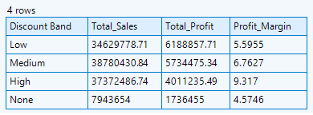 </kbd> <br>
        Fig.8. Discount impact on revenue
    </p>
        
    #### **Output Overview**<br/>
    We have analyzed the sales performance based on different discount bands. The dataset contains the following columns:
    1. **Discount Band**: The level of discount applied to the products.
    2. **Total Sales**: The total sales revenue generated.
    3. **Total Profit**: The total profit earned.
    4. **Profit Margin**: The percentage of profit relative to sales.

    #### Interpretation of Results

    1. **Medium Discount Band**:
    - **Highest Total Sales**: Products with a medium level of discounts generate the highest sales.
    - **Insight**: Moderate discounts appeal to a broader customer base.

    2. **High Discount Band**:
    - **Second Highest Total Sales**: Attracts a good number of customers but is less effective than medium discounts.
    - **Insight**: High discounts might be applied to fewer products or attract more price-sensitive but less frequent customers.

    3. **Low Discount Band**:
    - **Lower Sales**: Smaller discounts are not as attractive to customers, leading to fewer purchases.
    - **Insight**: Customers are less motivated to buy with minimal discounts.

    4. **No Discount Band**:
    - **Lowest Sales**: Products without any discounts generate the least sales.
    - **Insight**: Customers expect or prefer discounts and are less inclined to purchase without them.

    #### Business Insights
    - **Effective Discount Strategy**:
    - **Medium Discount Band**: Most balanced and effective for generating high sales volume.
    - **High Discount Band**: Effective in driving sales but could lead to lower profit margins or be less sustainable.

    #### Testing Profit Margin Hypothesis
    - **Hypothesis**: High discounts result in lower profit margins.
    - **Test**: Replace total sales with total profit to see the effect of discount levels on profit.

    #### Results of Profit Margin Test
    - **Observation**: 
    - **Low Discount**: Higher profit.
    - **High Discount**: Lower profit.

    - **Conclusion**: The hypothesis is confirmed. High discounts lead to lower profit margins, and vice versa.

    ### Conclusion
    This analysis highlights the importance of finding a balanced discount strategy. Medium discounts are most effective in generating sales, while high discounts, although effective, could reduce profit margins.

2. **Profit Margin Analysis** : Use the following SQL commands 

    ```sql
    SELECT
        Product,
        SUM(Sales) AS Total_Sales,
        SUM(Profit) AS Total_Profit,
        (SUM(Sales)/SUM(Profit)) AS Profit_Margin
    FROM Financials
    Group BY Product
    ORDER BY Profit_Margin DESC
    ```
    <p align="center">
    <kbd>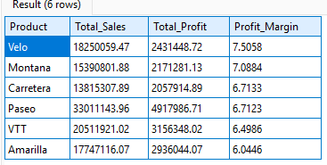 </kbd> <br>
        Fig.9. Profit Margin Analysis
    </p>
        
    #### Output Overview
    We have analyzed the profit margins of various products and identified the top and bottom performers.

    #### Breakdown of Profit Margins
    1. **Top 5 Products by Profit Margin**:
    - **1. Amarilla**: 
        - **Profit Margin**: 16.5%
        - **Insight**: Highest profit margin among all products.
    - **2. CTT**: 
        - **Profit Margin**: 15%
        - **Insight**: Second highest profit margin.
    - **3. Paseo**: 
        - **Profit Margin**: 14%
        - **Insight**: Despite having the highest total sales revenue, Paseo ranks third in profit margin.
    - **4. Carrera**: 
        - **Profit Margin**: 14.9%
        - **Insight**: Strong performer in terms of profit margin.
    - **5. Montana**: 
        - **Profit Margin**: 14.1%
        - **Insight**: Rounds up the top five.

    2. **Lowest Profit Margin**:
    - **Fellow**:
        - **Profit Margin**: 13.3%
        - **Insight**: Lowest profit margin among the listed products.

    #### Business Insights
    - **Maximizing Profit**:
    - **High Profit Margin Products**: Focus on products like Amarilla, which generate the highest profit margin (16.5%). Selling more of these products can significantly maximize profits.
    - **Strategic Decisions**: Evaluate products not just by total sales revenue but by profit margin as well. This ensures a better understanding of which products contribute most to the bottom line.

    ### Conclusion
    This analysis highlights the importance of considering both sales revenue and profit margin when making business decisions. While Paseo has the highest sales revenue, Amarilla leads in profit margin, demonstrating that high sales do not always equate to high profits.
 
3. **Customer Segmentation Analysis** : Use the following SQL commands

    ```sql
    SELECT
        Segment,
        Country,
        Product,
        SUM(Sales) As Total_Sales,
        SUM(Profit) AS Total_Profit,
        SUM("Units Sold") AS Total_Units_Sold,
        AVG(Discounts) AS Average_Discouunt
    FROM Financials
    GROUP BY Segment, Country, Product
    ORDER BY Total_Sales DESC
    LIMIT 5;
    ```
    <p align="center">
    <kbd>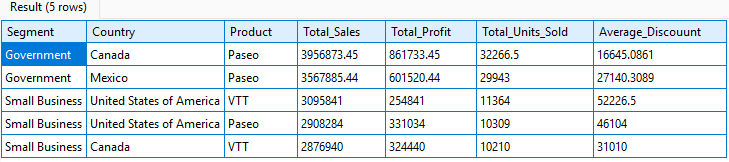 </kbd> <br>
        Fig.10. Customer Segmentation Analysis
    </p>
        
    #### Output Overview
    We have analyzed the sales performance across different segments. The dataset contains the following columns:
    1. **Segment**: The market segment.
    2. **Country**: The country where the sales were made.
    3. **Product**: The product sold.
    4. **Total Sales**: The total sales revenue generated.
    5. **Total Profit**: The total profit earned.
    6. **Total Units Sold**: The number of units sold.
    7. **Average Discount**: The average discount applied to the products.

    #### Interpretation of Results

    1. **Top Segment by Sales**:
    - **Segment**: Government
    - **Country**: Canada
    - **Top Performing Product**: Patio
    - **Total Sales**: $3.9 million

    2. **Second Highest Segment by Sales**:
    - **Segment**: Government
    - **Country**: Mexico
    - **Top Performing Product**: Paseo
    - **Total Sales**: $3.5 million

    #### Business Insights
    - **Government Segment**:
    - **Canada and Mexico**: The government segment in these countries shows the highest total sales and profitability for the product Paseo.
    - **Insight**: Indicates strong demand in these countries for this segment.

    - **Small Business Segment**:
    - **United States and Canada**: Preference for products like CTT and Paseo.
    - **Insight**: Suggests that these products are well-suited to small businesses. Targeted marketing strategies or optimized pricing for these demographics could further enhance sales.

    ### Conclusion
    This customer segmentation analysis provides valuable insights into which segments and products are performing the best. Focusing on the high-demand segments and tailoring marketing strategies accordingly can drive further growth.

4. **Simulating Budget Allocation Product** : Use the following SQL commands
    
    ```sql
    WITH Input AS(
        SELECT
            'Paseo' AS Selected_Product, 
            290 AS Estimated_Units_Sold
    )
    SELECT
        i.Estimated_Units_Sold,
        AVG(f."Manufacturing Price") AS Avg_Manufacturing_Price,
        i.Estimated_Units_Sold * AVG(f."Manufacturing Price") AS Estimated_Manufacturing_Budget
    FROM Financials f
    JOIN Input i ON f.Product = i.Selected_Product
    GROUP BY i.Estimated_Units_Sold;

    ```
    <p align="center">
    <kbd>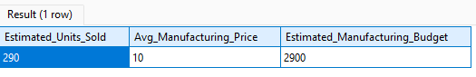 </kbd> <br>
        Fig.11. Simulating Budget Allocation
    </p>
        
    #### Output Overview
    The results of our analysis are presented in three columns:
    1. **Estimated Unit Sold**: The projected number of units to be produced.
    2. **Average Manufacturing Price**: The average cost to manufacture each unit.
    3. **Estimated Manufacturing Budget**: The total budget required for manufacturing.

    #### Calculation Details
    1. **Assumption**:
    - We plan to produce **290 units**.
    - The **average manufacturing price** per unit is **$10**.

    2. **Calculation**:
    - To estimate the manufacturing budget, we multiply the number of units by the average manufacturing price.
    - **Formula**: \( 290 \text{ units} \times \$10 \text{ per unit} = \$2,900 \).

    Thus, the estimated manufacturing budget for this particular product is **$2,900**.

    ### Conclusion
    That's the breakdown of the estimated manufacturing budget based on the given assumptions. This calculation provides a clear understanding of the financial requirements for production.

## Top Data
1. **Identifying Products with High COGS And Low Profit** : Use the following SQL commands 
    ```sql
    SELECT
        CONCAT(Product,'_',Segment,'-',Country) AS Unique_ID,
        Product,
        COGS,
        Profit,
        (Profit/COGS) AS Profit_COGS_Ratio
    FROM Financials
    WHERE COGS > 50000 AND Profit < 10000
    ORDER BY Profit_COGS_Ratio ASC;
    ```
    <p align="center">
    <kbd>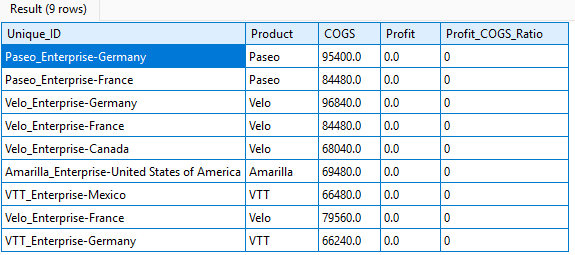 </kbd> <br>
        Fig.12. Identifying Products with High COGS and Low Profit
    </p>
        
    **Result** 
    - the product with the lowest profit to Cogs ratio is Paseo.  The segment is enterprise and the country is Germany.
    - the second one is also Paseo. The segment is also enterprise and the country is France
    
    **Business  insights can be derived from this analysis** 
    - able to identify inefficiencies of product with low profit margins relative to their Cogs  
    - can highlight areas where cost management or pricing strategies need improvement. 

2. **Analyzing Monthly Sales Performance** : Use the following SQL commands 
    ```sql
    --AnalyzingMonthlySalesPerformance
    SELECT
        strftime('%m', substr(Date, 7, 4) || '-' || substr(Date, 4, 2) || '-' || substr(Date, 1, 2)) AS Month_Number,
        SUM(Sales) AS Total_Sales
    FROM Financials
    WHERE substr(Date, 7, 4) = '2014'
    GROUP BY Month_Number
    ORDER BY Total_Sales DESC;
    ```
    <p align="center">
    <kbd>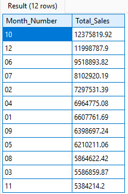 </kbd> <br>
        Fig.13. Analyzing Monthly Sales Performance
    </p>
        
    **Result**
    - The highest total sales is October. 
    - the second highest total sales is December. 

    **Business  insights can be derived from this analysis.** 
    - Highlights seasonal trends in sales, with the highest revenue generated in October 
    - and a strong overall performance in the final quarter or Q4. 
    - These findings can help in planning inventory, marketing campaigns and budget allocations for peak salesman. 


## Financial Growth Projection

1. **Financial Growth Projection Analysis** : Use the following SQL commands 
    ```sql
    --FinancialGrowthProjection
    WITH Monthly_Sales AS (
    SELECT
        strftime('%m', substr(Date, 7, 4) || '-' || substr(Date, 4, 2) || '-' || substr(Date, 1, 2)) AS Month_Number,
        SUM(Sales) AS Total_Sales
    FROM Financials
    WHERE substr(Date, 7, 4) = '2014'
    GROUP BY Month_Number
    ),
    GrowthRate AS(
    SELECT
        Month_Number,
        Total_Sales,
        ROUND((Total_Sales - LAG(Total_Sales) OVER (ORDER BY Month_Number)) * 1.0/LAG(Total_Sales) OVER (ORDER BY Month_Number), 4) AS Monthly_Growth
    FROM Monthly_Sales
    ),
    AvgGrowth AS(
    SELECT
        ROUND(AVG(Monthly_Growth),4) AS Avg_Monthly_Growth
    FROM GrowthRate
    )
    SELECT
        Month_Number,
        Total_Sales,
        Monthly_Growth,
        (SELECT Avg_Monthly_Growth FROM AvgGrowth) AS Avg_Monthly_Growth,
        CASE
            WHEN Month_Number = '12' THEN ROUND(Total_Sales * (1 + (SELECT Avg_Monthly_Growth fROM AvgGrowth)),2)
            ELSE NULL
        END AS Projected_Sales_13th_Month
    FROM GrowthRate
    ```
    <p align="center">
    <kbd>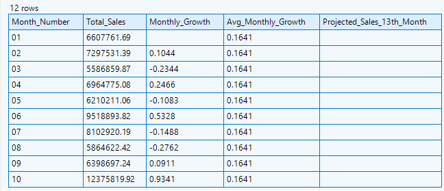 </kbd> <br>
        Fig.14. Financial Growth Projection
    </p>
        

    #### **Columns Overview**
    - **Month Number**: Indicates the specific month in the timeline.
    - **Total Sales**: Represents the total sales for each month.
    - **Monthly Growth**: Shows the growth rate of sales from one month to the next.
    - **Average Monthly Growth**: The average growth rate calculated over the entire period.
    - **Projected Sales for 13th Month**: Forecasted sales value for the hypothetical 13th month.

    #### **Details**
    1. **Total Sales per Month**:
    - This column displays the total sales achieved in each month.

    2. **Monthly Growth Rate**:
    - This column shows how sales have grown or declined compared to the previous month.
    - **Note**: The value is `NULL` for the first month because there is no prior data for comparison.

    3. **Average Monthly Growth Rate**:
    - This column provides the average growth rate across all the months analyzed.

    4. **Projected Sales for the 13th Month**:
    - Based on historical growth rates, the forecasted sales for the 13th month are approximately 13.9 million. When rounded, this value is close to 14 million.

    #### **Business Insights**
    - **Future Planning**: By projecting sales for a hypothetical 13th month, businesses can better plan for future demand.
    - **Resource Allocation**: Insights from projected sales help in efficient allocation of resources.
    - **Financial Strategies**: Adjust financial strategies based on the expected growth and sales trends.

    This analysis provides a clear view of past performance and helps in making informed decisions for the future. 

    ---
